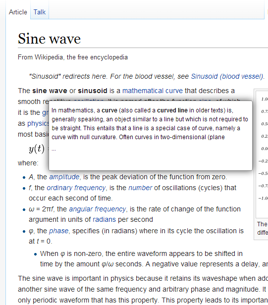

betterWikipedia
===============
Better wikipedia reading based on this http://www.gizmodo.co.uk/2014/04/i-wish-i-could-read-wikipedia-like-this/

This is a work in progress.

 
Instructions:
--
* If your browser doesn't support userscript install a plugin such as Greasemonkey (Firefox) or Tampermonkey (Chrome)
* Install the userscript from [here](betterWikipedia.user.js)

TODO: 
* Middle-mouse clicks and similar actions to open link in new tab should open them in new tab 
* Do a better query of the wikipedia API
* Nested queries
* Expand current content
* Use fancy inlining of content instead of windows
